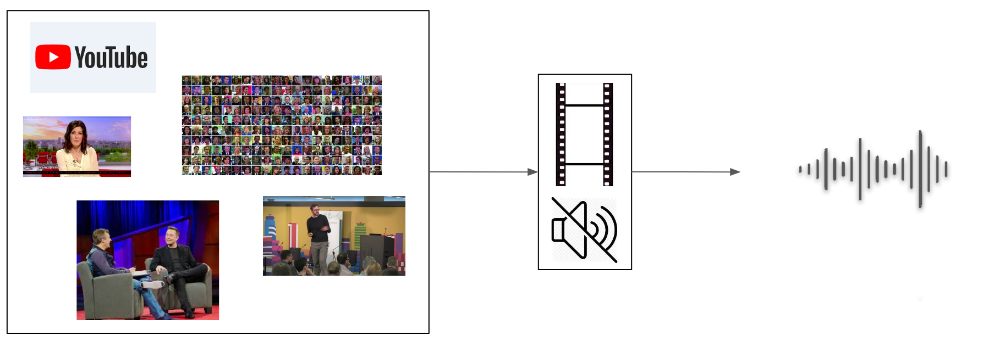
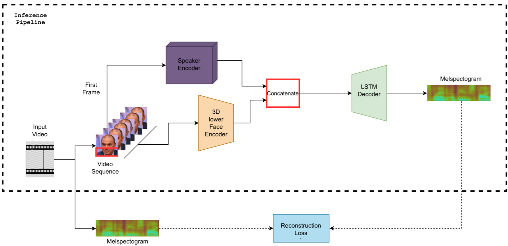
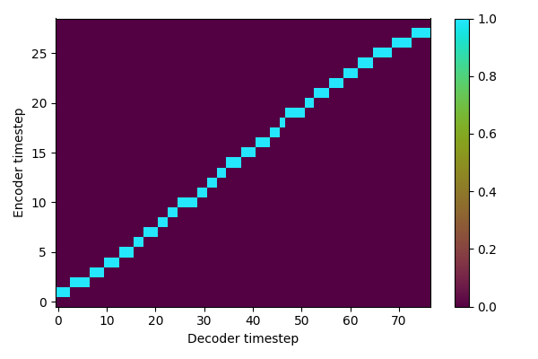
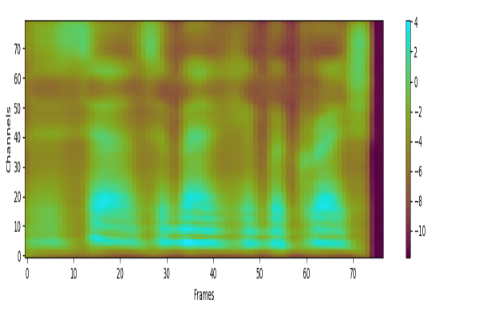

# Lip2Speech [[PDF](Report.pdf)]

A pipeline for lip reading a silent speaking face in a video and generate speech for the lip-read content, i.e Lip to Speech Synthesis.

<p align="center">
</br>
</p>


Video Input                      |  Processed Input          |  Speech Output 
:-------------------------:|:-------------------------:|:-------------------------:
       |      |  


## Architecture Overview

<p align="center">
</br>
</p>

### LRW 
Alignment Plot                      |  Melspectogram Output          
:-------------------------:|:-------------------------:|
       |    


## Usage

### Demo

The pretrained model is available [here](https://www.mediafire.com/file/evktjxytts2t72c/lip2speech_final.pth/file) [265.12 MB]

Download the pretrained model and place it inside **savedmodels** directory. To visulaize the results,  we run demo.py.

```
python3 demo.py
``` 

#### Default arguments

* dataset: LRW (10 Samples)
* root: Datasets/SAMPLE_LRW
* model_path: savedmodels/lip2speech_final.pth
* encoding: voice


### Evaluate 

Evaluates the ESTOI score for the given Lip2Speech model. (Higer is better)

```
python3 evaluate.py --dataset LRW --root Datasets/LRW --model_path savedmodels/lip2speech_final.pth
```


### Train

To train the model, we run train.py

```
python3 train.py --dataset LRW --root Datasets/LRW --finetune_model_path savedmodels/lip2speech_final.pth
```

* finetune_model_path - Use as base model to finetune to dataset. (optional)


## Acknowledgement

[tacotron2](https://github.com/NVIDIA/tacotron2)


## Citation

If you use this software in your work, please cite it using the following metadata.


```
@software{Millerdurai_Lip2Speech_2021,
author = {Millerdurai, Christen and Abdel Khaliq, Lotfy and Ulrich, Timon},
month = {8},
title = {{Lip2Speech}},
url = {https://github.com/Chris10M/Lip2Speech},
version = {1.0.0},
year = {2021}
}
```
